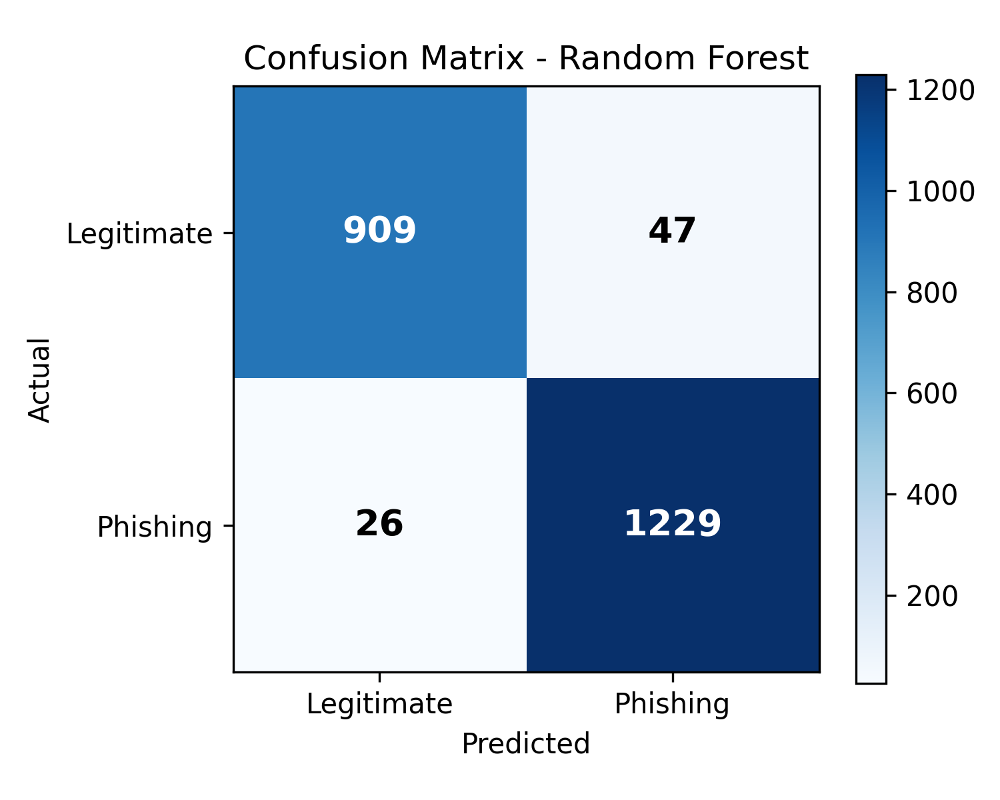

# 🛡️ Phishing Website Detection using Machine Learning

A comparative study of Logistic Regression, Random Forest, and SVM for detecting phishing websites, using the UCI Phishing Websites dataset (11,055 instances, 30 features).

**TL;DR:** Random Forest performed best, with **96.70% accuracy** on a held-out test set. SSL certificate state and anchor-link behavior were the most predictive features.

## 📊 Results

| Model | Accuracy | Precision (macro) | Recall (macro) | F1 (macro) | 5-fold CV (mean ± std) |
|---|---|---|---|---|---|
| Logistic Regression | 92.45% | 0.92 | 0.92 | 0.92 | 92.28% ± 0.48% |
| **Random Forest** 🏆 | **96.70%** | **0.97** | **0.97** | **0.97** | **96.84% ± 1.51%** |
| SVM (RBF) | 94.71% | 0.95 | 0.95 | 0.95 | 94.46% ± 0.66% |

Precision, recall and F1 are macro averages over both classes on the 2,211-sample test set. For the phishing class alone (label `-1`), Random Forest reached precision 0.97 and recall 0.95, so 47 of 956 phishing sites (about 4.9%) were missed, while 26 of 1,255 legitimate sites (about 2.1%) were wrongly flagged as phishing.


### Confusion matrix (Random Forest)



A missed phishing site (false negative) is usually the costlier error in this setting, so recall on the phishing class matters more than overall accuracy.

### Feature importance

**Key finding:** SSL certificate state (`sslfinal_state`) and anchor-link behavior (`url_of_anchor`) were the two most predictive features, together accounting for roughly 60% of the Random Forest model's feature importance.


## 📁 Dataset

[UCI Phishing Websites Dataset](https://archive.ics.uci.edu/dataset/327/phishing) — Mohammad, R. & McCluskey, L. (2012). Donated to the UCI Machine Learning Repository in 2015. Licensed under CC BY 4.0.

In the target column, `-1` means phishing (4,898 sites) and `1` means legitimate (6,157 sites).

## 🧠 Methodology

1. Data loading via the official `ucimlrepo` package
2. Data quality checks (no missing values found)
3. 80/20 random train-test split (`random_state=42`)
4. Training three classifiers: Logistic Regression, Random Forest, SVM (RBF kernel)
5. Evaluation via accuracy, precision, recall, F1-score, and 5-fold cross-validation
6. Feature importance analysis on the best-performing model

## ⚠️ Limitations

- The dataset dates from around 2015, and phishing techniques have changed since then, so results may not generalize to current attacks.
- Features are pre-extracted, hand-crafted website attributes. The models never see raw URLs, page content, or screenshots.
- The results come from a single dataset and one random train/test split (not stratified), with no external validation set.

## 🛠️ Tech Stack

- Python 3
- scikit-learn
- pandas
- matplotlib / seaborn
- Google Colab

## 🚀 How to Run

```bash
pip install ucimlrepo scikit-learn pandas matplotlib seaborn
```

Open `phishing_detection.ipynb` in Jupyter or Google Colab and run all cells in order.

## 📄 Full Paper

The complete academic write-up (introduction, related work, methodology, results, discussion) is available in [`Phishing_Detection_Paper.docx`](./Phishing_Detection_Paper.docx).

## 👤 Author

**Elnazeer Dawod Suliman**

## 📜 License

This project uses a publicly available dataset licensed under CC BY 4.0. Code in this repository is released under the MIT License.
