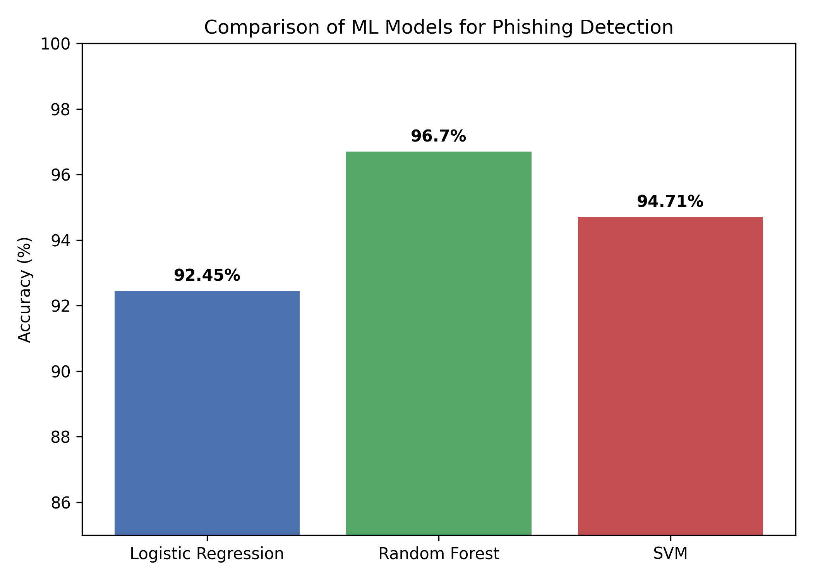
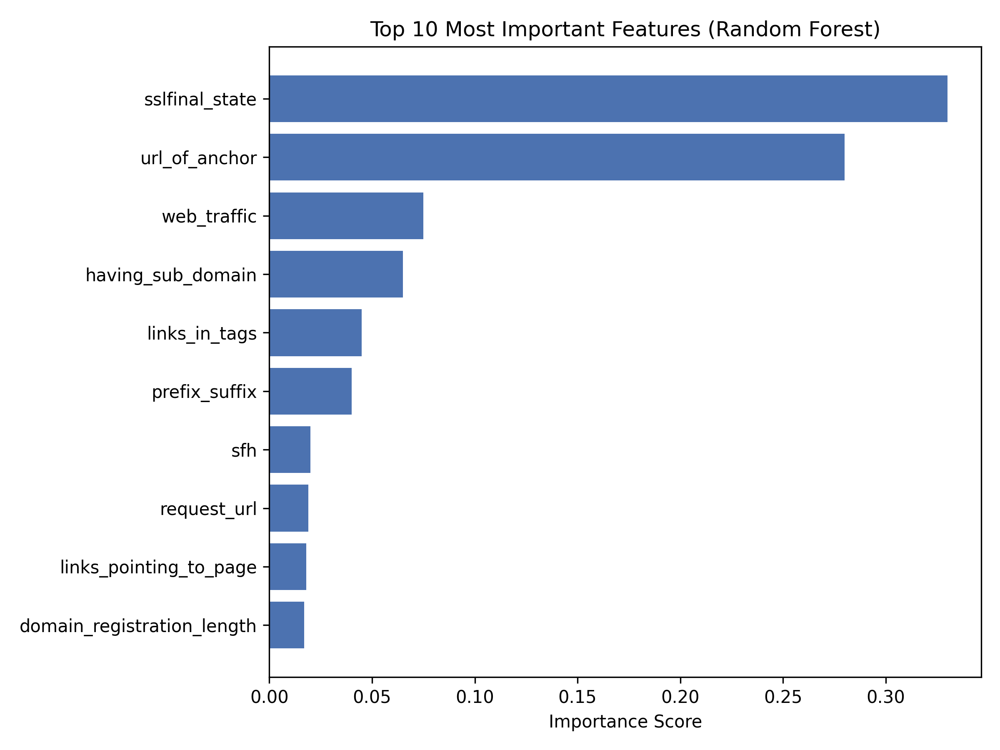

# 🛡️ Phishing Website Detection using Machine Learning

A comparative study of Logistic Regression, Random Forest, and SVM for detecting phishing websites, using the UCI Phishing Websites dataset (11,055 instances, 30 features).

## 📊 Results

| Model | Accuracy | Precision | Recall |
|---|---|---|---|
| Logistic Regression | 92.45% | 0.92 | 0.92 |
| **Random Forest** 🏆 | **96.70%** | **0.97** | **0.97** |
| SVM | 94.71% | 0.95 | 0.95 |



**Key finding:** SSL certificate state and anchor-link behavior were the two most predictive features, together accounting for roughly 60% of the Random Forest model's decision importance.



## 📁 Dataset

[UCI Phishing Websites Dataset](https://archive.ics.uci.edu/dataset/327/phishing) — Mohammad, R. & McCluskey, L. (2015). Donated to the UCI Machine Learning Repository.

## 🧠 Methodology

1. Data loading via the official `ucimlrepo` package
2. Data quality checks (no missing values found)
3. 80/20 stratified train-test split
4. Training three classifiers: Logistic Regression, Random Forest, SVM (RBF kernel)
5. Evaluation via accuracy, precision, recall, F1-score, and 5-fold cross-validation
6. Feature importance analysis on the best-performing model

## 🛠️ Tech Stack

- Python 3
- scikit-learn
- pandas
- matplotlib / seaborn
- Google Colab

## 🚀 How to Run

```bash
pip install ucimlrepo scikit-learn pandas matplotlib seaborn
```

Open `phishing_detection.ipynb` in Jupyter or Google Colab and run all cells in order.

## 📄 Full Paper

The complete academic write-up (introduction, related work, methodology, results, discussion) is available in [`Phishing_Detection_Paper.docx`](./Phishing_Detection_Paper.docx).

## 👤 Author

**Elnazeer Dawod Suliman**

## 📜 License

This project uses a publicly available dataset licensed under CC BY 4.0. Code in this repository is released under the MIT License.
